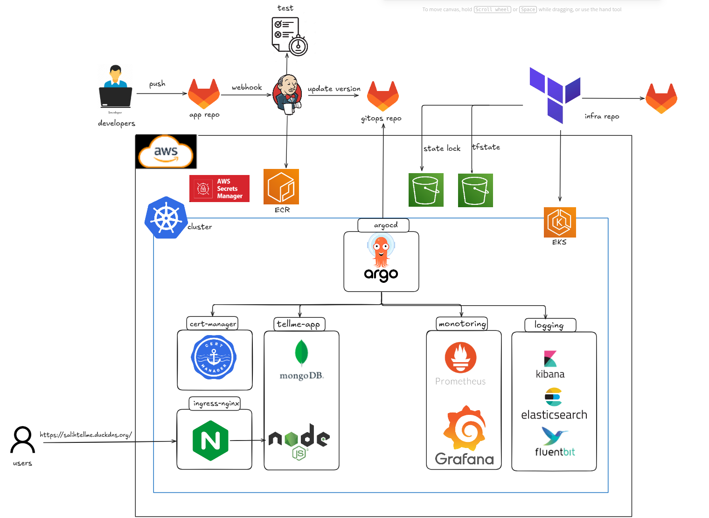
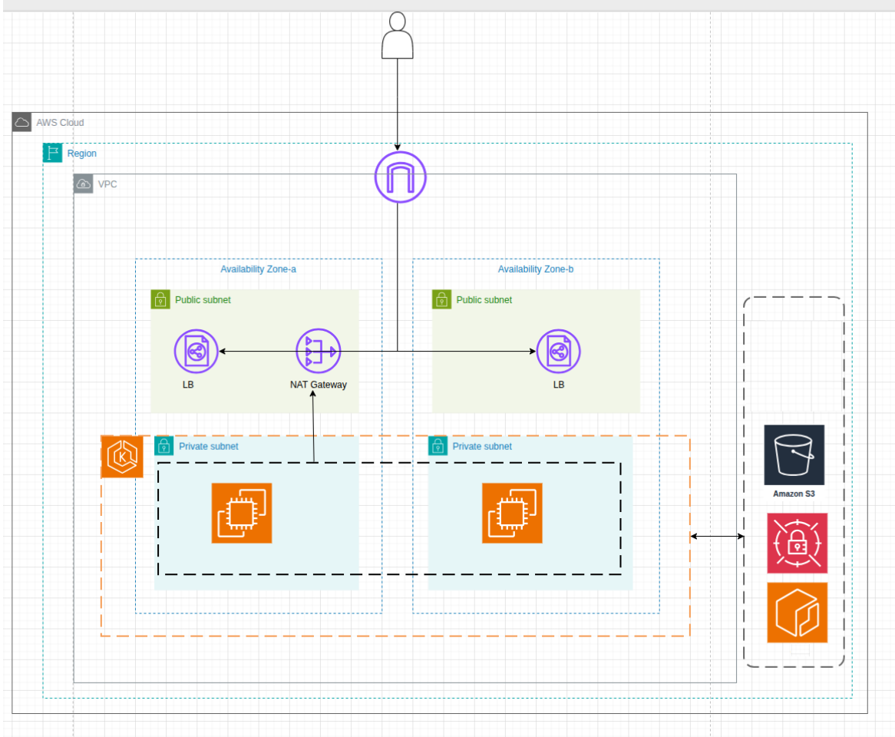
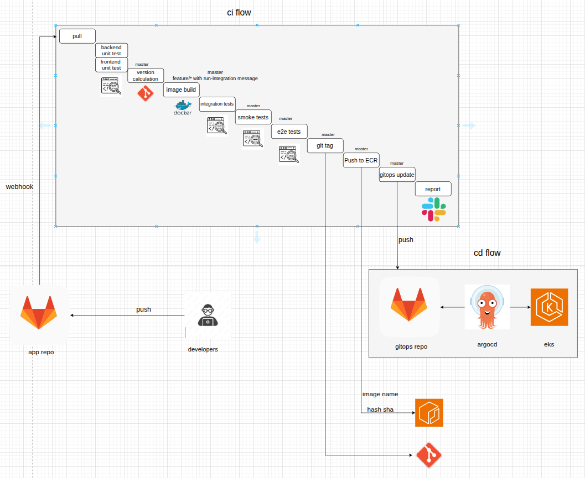
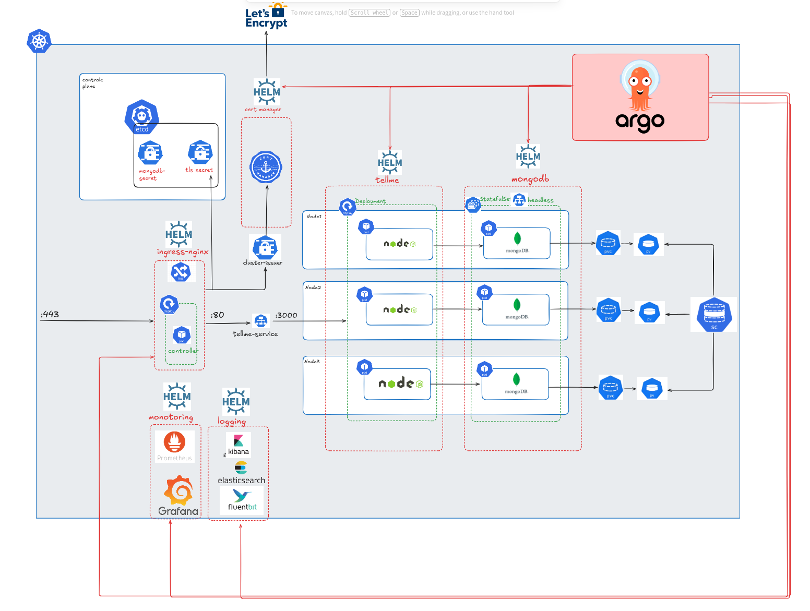
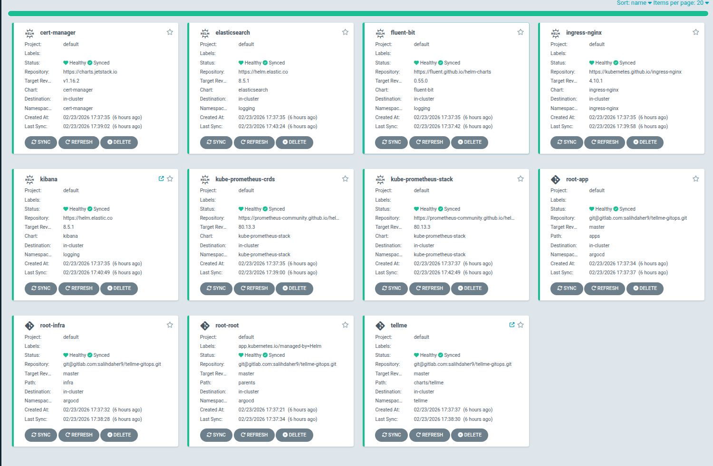

# TellMe — Production-Grade DevOps Pipeline on AWS

End-to-end DevOps project: a full-stack application deployed on AWS EKS with automated CI/CD, GitOps, monitoring, logging, and secret management.

## Architecture

## AWS Infrastructure

Provisioned entirely with **Terraform** (modularized):
- **VPC** with public/private subnets across multiple AZs
- **EKS** cluster with managed node groups in private subnets
- **IAM** roles with least-privilege policies (IRSA for pod-level AWS access)
- **EBS CSI Driver** for dynamic persistent volume provisioning
- **OIDC Provider** enabling Kubernetes service accounts to assume AWS IAM roles

## CI/CD Pipeline

**Jenkins** multi-stage pipeline triggered on push to master:

1. **Unit Tests** — parallel backend + frontend tests in Docker containers
2. **Versioning** — auto-increment semver from VERSION file + git tags
3. **Package** — Docker image build
4. **Deploy Test Env** — docker compose with real MongoDB
5. **Integration Tests** — run against real database inside containers
6. **Smoke Tests** — health + auth verification via curl
7. **E2E Tests** — full user journey validation
8. **Tag & Publish** — git tag + push to AWS ECR (version tag + SHA)
9. **Update GitOps** — push new image tag to gitops repo, triggering ArgoCD sync

Feature branches run unit tests only, with opt-in integration tests via `[run-integration]` commit flag.

## GitOps & Kubernetes

**ArgoCD** manages all cluster resources using the **App-of-Apps** pattern:

- **Helm Charts** — templated deployments with HPA, liveness/readiness probes, pod anti-affinity
- **NetworkPolicies** — default-deny with selective allow for ingress and Prometheus scraping
- **External Secrets Operator** — pulls credentials from AWS Secrets Manager via IRSA (no hardcoded secrets)
- **Ingress-NGINX** + **cert-manager** — HTTPS with auto-provisioned Let's Encrypt certificates
- **MongoDB ReplicaSet** — primary + secondary + arbiter for high availability

## Monitoring

- **Prometheus** (kube-prometheus-stack) scrapes app metrics via ServiceMonitor
- **Grafana** dashboards: request rate, error rate, latency (p50/p95/p99), in-flight requests, DB connections

## Logging

- **Fluent Bit** (DaemonSet) collects logs from all nodes
- **Elasticsearch** stores logs in separate indices per source (app, ingress, mongodb, k8s, host)
- **Kibana** for visualization and search

## Tech Stack

| Category | Tools |
|----------|-------|
| Cloud | AWS (EKS, ECR, IAM, VPC, Secrets Manager, EBS) |
| IaC | Terraform (modularized) |
| Containers | Docker, Kubernetes, Helm |
| CI/CD | Jenkins (multi-stage pipeline) |
| GitOps | ArgoCD (App-of-Apps pattern) |
| Monitoring | Prometheus, Grafana, ServiceMonitor |
| Logging | Fluent Bit, Elasticsearch, Kibana |
| Security | NetworkPolicies, IRSA, External Secrets Operator, cert-manager, TLS |
| Application | Node.js, Express, MongoDB (ReplicaSet) |

