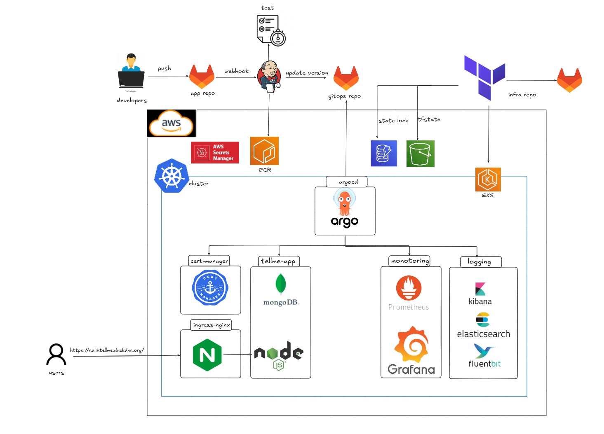

# TellMe App

Backend + frontend application for movie recommendations, running in Docker/Kubernetes.

## What’s Here
- `backend/`: Node.js API
- `frontend/`: static SPA
- `docker-compose.yml`: local/dev stack
- `Jenkinsfile`: CI pipeline
- `e2e-tests/`, `smoke-tests/`: CI test runners

## Local Dev
```bash
docker compose --env-file .env.test up -d --build
```

## CI
Pipeline runs:
1. Unit tests (backend + frontend, parallel)
2. Integration tests (compose app container)
3. Smoke tests
4. E2E curl tests
5. Build + publish + GitOps update

## Diagram
**CI/CD Flow**


**App Flow**


## Notes
Static content is served by the app container; ingress handles routing.
