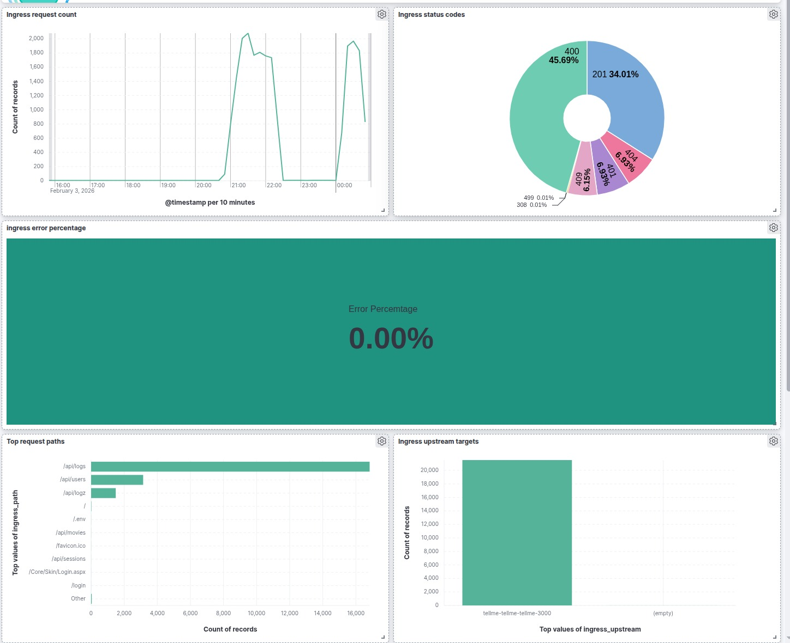

# TellMe GitOps

GitOps repo for all Kubernetes workloads: infra + app.

## Structure
- `root-root.yaml`: App-of-apps root
- `parents/`: root-app + root-infra
- `infra/`: ArgoCD Applications for ingress, cert-manager, monitoring, logging
- `apps/`: App workloads (tellme)
- `charts/`: Helm charts (umbrella app + subcharts)
- `values/`: environment values (prod)

## How It Deploys
ArgoCD syncs `root-root` → `parents` → `infra` + `apps`.

## Diagram
**Application / Kubernetes**

## Observability
**Logging (infra)**

**Logging (app)**

**Monitoring (infra)**

**Monitoring (app)**

## Notes
Secrets are managed via AWS Secrets Manager + External Secrets Operator.
